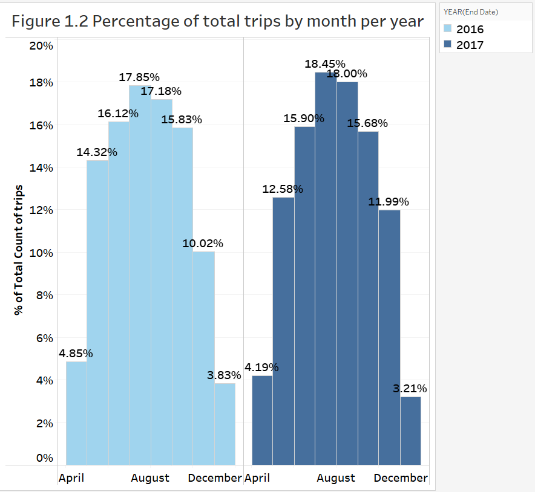
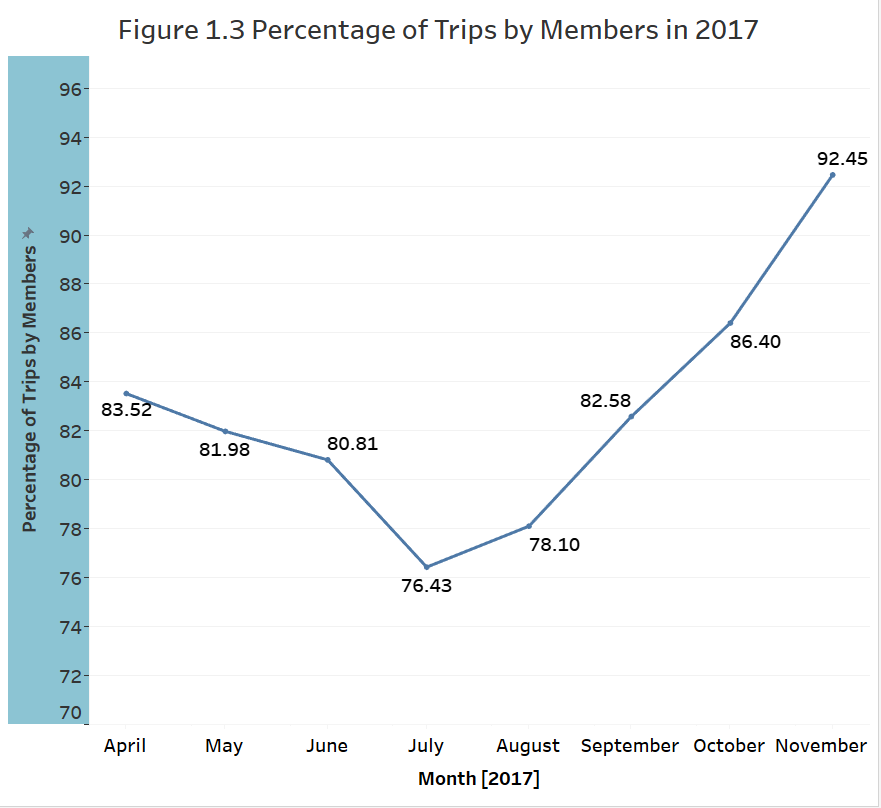
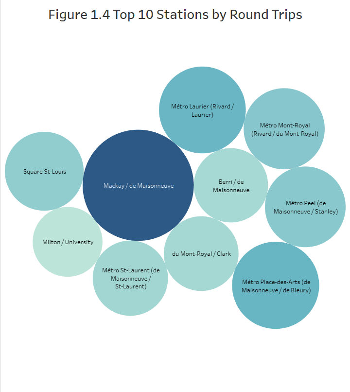
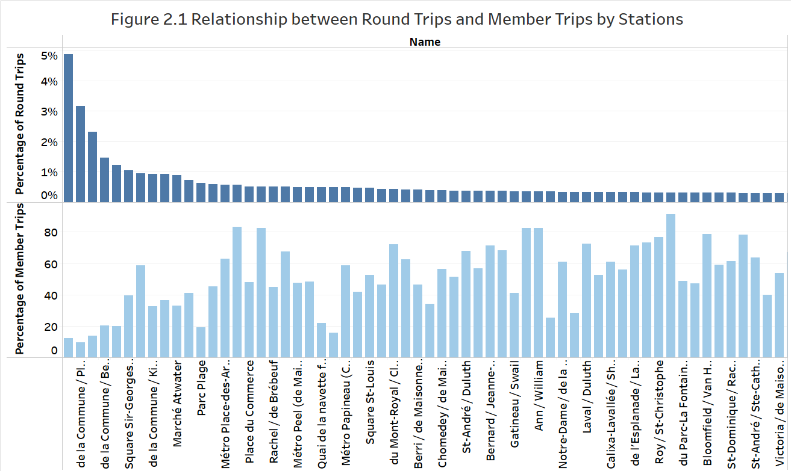
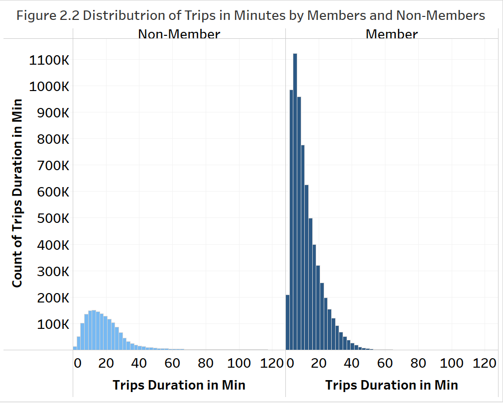
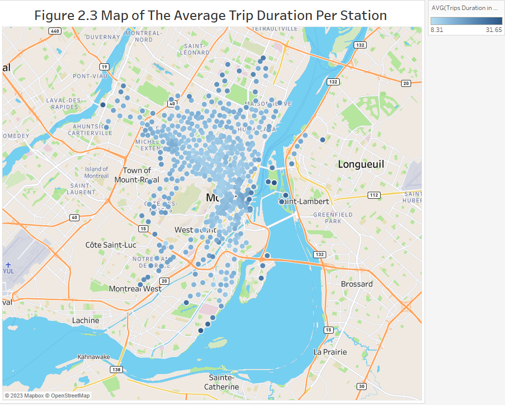
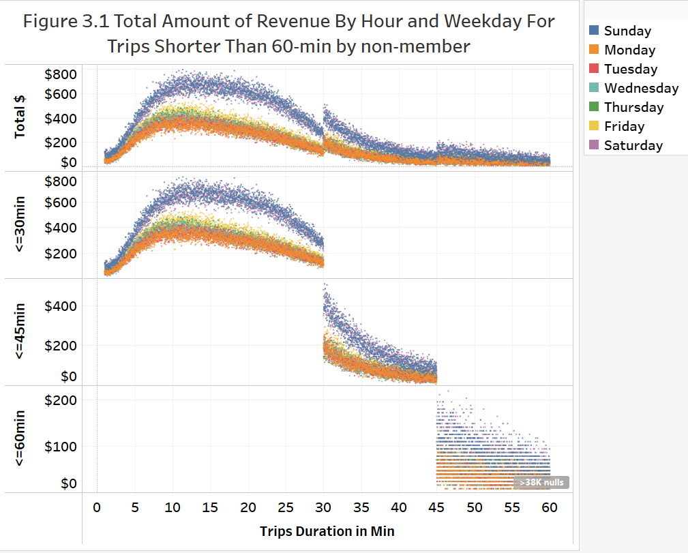
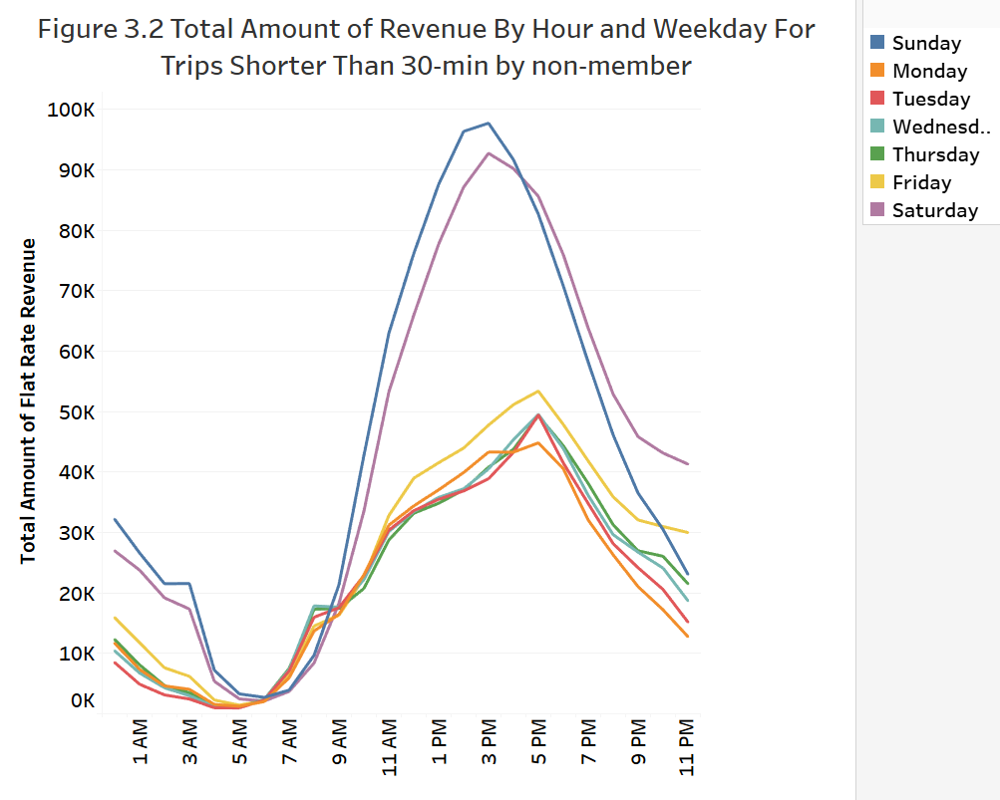

# Bixi Bike Sharing Program 

# Introduction
BIXI Montreal (“BIXI”) is a non-profit organization created in 2014 by the city of Montreal to manage its bike-sharing system. BIXI has about 10,000 regular and electric bikes spreading across 800 stations in Montreal . BIXI is part of Montreal’s public transit system. Similarly, Vancouver’s public bike share program, Mobi by Shaw Go, has a similar model but on a smaller scale than BIXI Montreal.   Source: https://www.bixi.com/en/open-data

The goal of this report is to gain an overview understanding of how people use BIXI bikes such as the factors that influence the volume of usage, trends in popular stations, and overall business growth. The open data source was downloaded from BIXI for the period between 2016 to 2017 including data on trips and the location of stations. A SQL file is attached separately detailing the data analysis of BIXI bikes. 

# The Analytical Process
## Overview of BIXI bikes’ volume of usage throughout the months




Figure 1.1 Total Number of Monthly Trips showed an increase in usage from 2016 to 2017. The months from May to October showed the highest trip usage, with up to 700K trips made in July 2016 and 900K trips in July 2017 ( a 30% increase in the busiest month). Figure 1.2 Percentage of Total Trips by Month per Year showed a similar percentage in both years. The four months from June to September were accounted for over 67% of the total trips in both 2016 and 2017. Thus, BIXI bikes had the highest usage in the summer months.





Figure 1.3 Percentage of Trips by members in 2017 showed the trend of member usage in 2017 by month. The percentage of trips my member was lowest in July 2017 and increased to the highest in November. However, compared to Figure 1.1, the trip usage was the highest in July 2017 which showed that there was a significant increase in non-member usage in July as well and decreased by November. Figure 1.4 The Top 10 Stations by Round Trips showed that Mackay/ de Maisonneuve was the most round-trip station which accounted for over 18% of all the round trips. Metro Laurier and Metro Place-des-Arts followed by 2nd and 3rd stations with the most round trips.

## Trip length and behaviour of member usage



As requested by the marketing team, Figure 2.1 showed the relationship between round trips and member trips by stations in both 2016 and 2017. Metro Jean-Drapeau station had the highest percentage of round trips (4.8%) but one of the lowest member trips (12%). 



Figure 2.2 showed the distribution of trip duration in minutes for members and non-members. Both members and non-members had similar distributions in trip duration which was between 5-30 minutes. Non-member trip duration was mostly between 10-30 minutes and one-way trips (according to Figure 2.1) while it was between 5-20 minutes for members. This was reasonable because non-members would only rent the bike if it was worth the time from walking and downloading/paying via the BIXI app, thus, the trip duration must usually last longer than 10 minutes to justify all the hassles of using the app. On the other hand, members have the BIXI app ready, so they usually use the service as much as possible for short or long trips to justify the subscription fee paid.

Similar trends at other stations showed a high percentage of round trips usually had a low percentage of member trips. As seen in Figure 2.3 below, the red dots represented the stations with the highest percentage of round trips. They were 
- Metro Jean-Drapeau (St.Helen’s Island)
- de la Commune/ Place Jacques-Cartier (Old Port Montreal)
- de la Commune/ St-Sulpice (Old Port Montreal)
- de la Commune/ Berri (Old Port Montreal)



All these locations are tourist attractions which are explained for the highest round trips in which customers from other areas came in their vehicles, rent the bikes then returned to the same location. Moreover, as they are tourist stations, they usually have more non-member trips than other locations. 

Figure 2.3 showed the average trip duration per station in Montreal. The trip duration was usually less than 10 minutes at the center then slowly increased in length as it went outward up to an average of 30 minutes. At the center is downtown Montreal with multiple BIXI stations,  universities, the subway stations, and travelling by bike would be more convenient than walking or by car. Moving further away, there were fewer BIXI stations thus trip duration increased.

## Pricing and Flat-rate Revenue Model for Single Trips



Figure 3.1 showed the total revenue for trips shorter than 60-min by non-members in 2016 and 2017. Weekend generated the most revenue which was between $600-$800/day with trips less than 30 minutes in length. Weekday generated less amount between $200-$500/day with trips less than 30-minute. For trips longer than 30-minute, the average revenue dropped significantly from $400 to $0 as the duration got longer. Thus, weekends and 30-min or less trip generated the most revenue for non-member usage. 



Similarly, Figure 3.2 showed the total revenue generated from single, shorter trips that were less than 30 min for non-members and infrequent users. Sunday and Saturday generated the most revenue which was as high as $80K and high $70K each day during peak hours throughout 2016 and 2017. The afternoon and evening hours were the best for single, shorter trips between 1 PM - 8 PM. Early morning hours between 3 AM - 7 AM was the worst hour in generated revenue. 

# Conclusion

BIXI bike had a 30% growth in usage from 2016, up to 900K trips made in July 2017. Summer months recorded the most trips which accounted for 67% of total trips. Mackay/ de Maisonneuve station had the most round trip recorded in 2016 and 2017, followed by Metro Laurier and Metro Place-des-Arts stations. For trip durations, member users had 5-20 minute trips on average, while non-member users had longer trips between 10-30 minutes on average. In addition, on the average, most shorter trips were at downtown Montreal and trip duration increased as it went further away from the center. Lastly, most revenues for single trips by infrequent users were generated on the weekend, in the afternoon and evening, and on trips less than 30-min. 

# Citation
Use this bibtex to cite this repository:

```
@misc{thai22011_Crypto_Clustering_PricePrediction_2022,
  title={Bixi Bike Sharing Program},
  author={Thai Nguyen},
  year={2/2023},
  publisher={Github},
  journal={GitHub repository},
  howpublished={\url{https://github.com/thai22011/bixi_viz}},
}
```